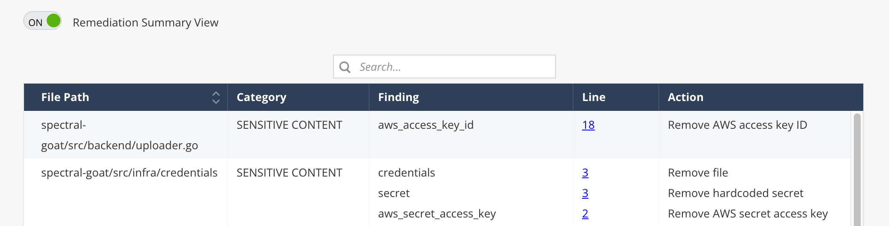
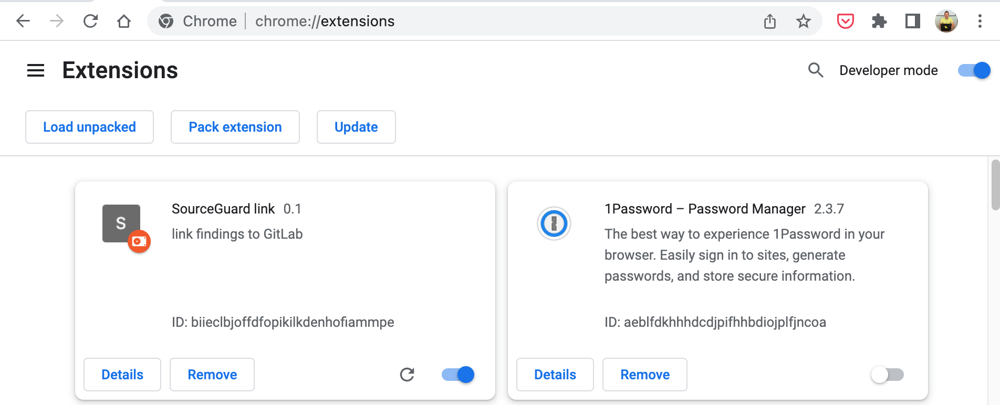
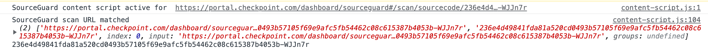
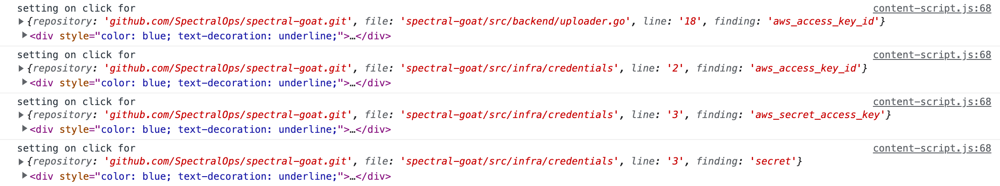

# Check Point Source Guard - link findings to GitHub/GitLab server

## Motivation

* add missing links from Check Point SourceGuard to source code on GitHub/GitLab server implemented as Chrome extension improving portal.checkpoint.com capabilities

## How it works

* implemented as injected script for URL https://portal.checkpoint.com/dashboard/sourceguard#/scan/sourcecode/\<scan-id\>
* works in Line column of Remediation Summmary View - line numbers are blue and underlined and open source on new browser tab on click

## Usage

* clone this repo
* open Chrome and visit chrome://extensions/ in Developer Mode
* load unpacked extension from cloned local folder

## Troubleshooting
* open Chrome Developer Tools, Console tab on page https://portal.checkpoint.com/dashboard/sourceguard#/scan/sourcecode/\<scan-id\> (when visiting specific scan) - enable Remediation Summmary View
* Console messages confirm that extension is active 

* and it was able to enhance page with links to source code files

* consider page refresh in Remediation Summary View in case line number links are not blue+underlined
